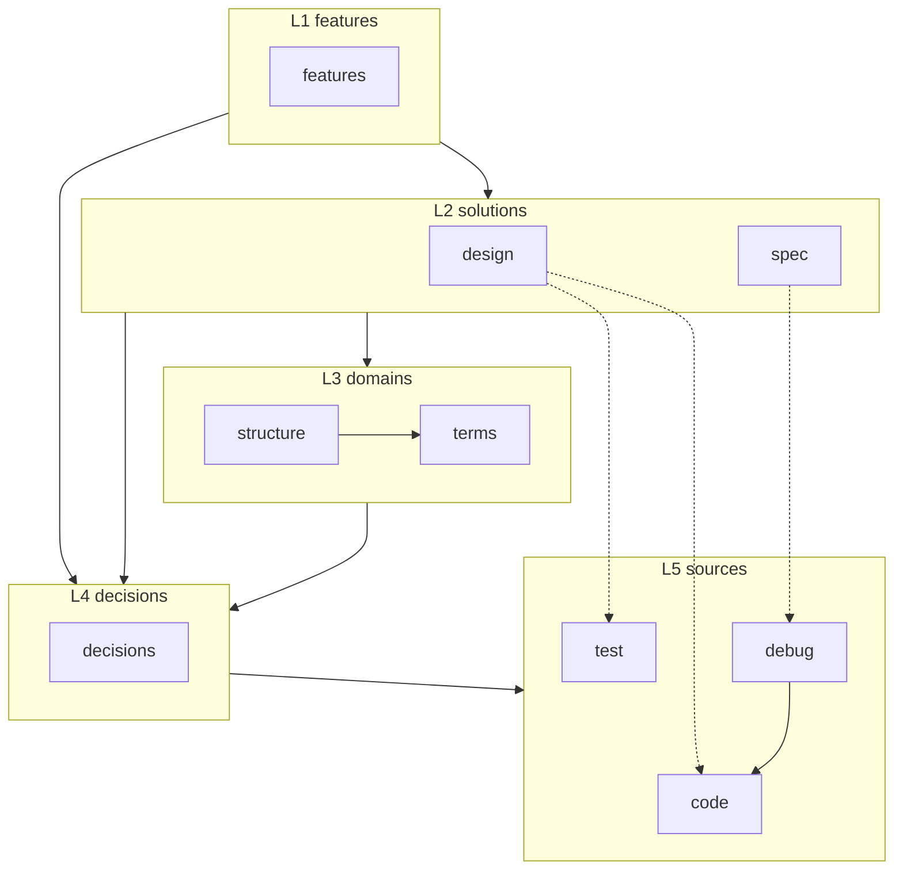

# Archivist

決断から文書を組み直すエージェント。

ADR は部分解であり、その集合だけでは実装に必要な文書群にならない。決断と実装方針の
中間には整理されない決断が残り、実装時に未考慮の部分を取りこぼす。archivist は
決断の集合を起点に、それが要求する上層の文書を書き起こす。**決断は下さない。**

## 層

情報の参照順序を7ノード5層で定める。層は「一つ下の層の要素が消えたときに一緒に
消えるかどうか」で分かれる。



実線が参照の方向で、上の層から直下の層へ引く。decisions だけは例外で、どの層からも
直接指せる——どの層のどの記述にも理由はあり得るため。破線は実装の対応を示す。

**spec と design は互いを引かない。** 前者は What を、後者は How を担当する対等な
並列で、互いを待たずに書ける。両者が矛盾していないことは、上の feature が
availability ごとの対応表として担保する。

検証も二つに割れる。**debug** は成果物を実環境で動かして spec の約束を判定し、
**test** は design が定めた材料をパーツ単位で判定する。前者は design を読まずに
書け、後者は design の改訂で壊れてよい。

**参照は上から下へ、書き起こしは下から上へ。** この二つは別のものを指す。

## コマンド

| コマンド | すること | 詳細 |
| --- | --- | --- |
| `/archivist` | 決断を起点に、届く範囲の文書を組み直す | [archivist](docs/archivist/L1_features/archivist.md) |
| `/archivist-term` | 決断が意味を確定させた語を1枚起こす | [term](docs/archivist/L1_features/term.md) |
| `/archivist-structure` | 決断が課した形を図として1枚起こす | [structure](docs/archivist/L1_features/structure.md) |
| `/archivist-spec` | 決断から導ける約束を要件と検証として書く | [spec](docs/archivist/L1_features/spec.md) |
| `/archivist-design` | 要件を満たす中身を材料と規則として書く | [design](docs/archivist/L1_features/design.md) |
| `/archivist-feature` | 決断が定めた機能を1枚書く | [feature](docs/archivist/L1_features/feature.md) |
| `/archivist-check` | 揃っているかを判定する。書き換えない | [check](docs/archivist/L1_features/check.md) |
| `/archivist-promote` | 実現先が揃った印を外し、流入リンクを追随させる | [promote](docs/archivist/L1_features/promote.md) |
| `/archivist-adopt` | 外にある決断記述を突き合わせ、採ったものを置く | [adopt](docs/archivist/L1_features/adopt.md) |

起動順は書き起こしの向きに従う。

```
term → structure → (spec & design) → feature
```

`/archivist` はこの順に呼び、各段で書くものが無ければ飛ばす。**層を飛ばさないことと、
全ての層に一枚ずつ作ることは別**になる。

## 印

実現先がまだ実在しない文書は、ファイル名の先頭に `_` を付ける。`ls` に印が出るので、
どこまでが現物でどこからが予定かが一覧で読める。

印が付くのは実現先を持つ三層だけ。

| 層 | 事実になる条件 |
| --- | --- |
| design | Parts の `target_file` 列のファイルが実在する |
| spec | 全ての検証が `手段:` を持ち、ファイルを宣言したものは実在する |
| feature | 参照する spec と design が両方事実 |
| structure / terms / decisions | 印が付かない。決まった時点で事実 |

見るのは実現先そのものが在るかどうかで、実現先を動かして得られる生成物ではない。

外すのは `/archivist-check` の報告を受けた `/archivist-promote`。check は読むだけで
書き換えない。

## 導入

skills.sh または Claude Code の skill として、`skills/` 以下を導入する。

```
npx skills add <owner>/<repo>
```

導入先には `docs/archivist/` が作られ、6つのディレクトリが各ノードに対応する。

```
docs/archivist/
  L1_features/  L2_specs/  L2_designs/  L3_structures/  L3_terms/  L4_articles/
```

## 担当外

- **決断を下すこと。** archivist は既に `L4_articles/` に置かれたものだけを読む
- **文書に無い実装を見つけること。** 実装から決断への還元は前段の仕事になる
- **検証が通ったかどうか。** 手段が用意されていれば足りる

## リポジトリ

```
skills/           配布される中身。スキル9本
docs/archivist/   archivist 自身の文書。archivist で書かれている
```

archivist は自分自身を archivist で文書化している。層と規則が実際に使えるかは、
`docs/archivist/` を読めば分かる。
