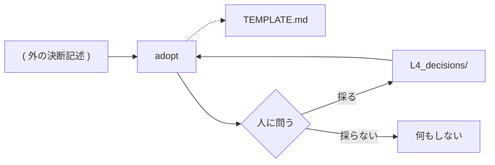

# adopt — 取り込みの設計

## Needs

| spec | needs |
| ---- | ----- |
| [R1](../L2_specs/_adopt.md#R1) | ディレクトリを引数に取り、無ければ問う口 |
| [R1](../L2_specs/_adopt.md#R1) | 一枚一文の決断記述かを判じ、外れたものを控える手 |
| [R2](../L2_specs/_adopt.md#R2) | `L4_decisions/` を読み、同義と矛盾を見つける手 |
| [R3](../L2_specs/_adopt.md#R3) | 候補を一枚ずつ示し、答えを待つ口 |
| [R4](../L2_specs/_adopt.md#R4) | 決断の書式を持つ型紙 |
| [R4](../L2_specs/_adopt.md#R4) | 名前の衝突を見て止まる手 |

## Parts

| target_name | target_file | IN | OUT |
| ----------- | ----------- | -- | --- |
| adopt | skills/archivist-adopt/SKILL.md | 決断記述の並ぶディレクトリ | L4_decisions/DECISION_NAME.md |
| template | skills/archivist-adopt/TEMPLATE.md | — | 決断の書式 |

### Relation

## Rules

- 書き込みは提示と回答の後にだけ起きる
    - Details: 突き合わせの途中で一枚も置かない。回答が無いまま終えたら `L4_decisions/` は変わらない
- 人が書いた決断を上書きしない
    - Details: 名前が衝突したら、その一枚を飛ばして報告する。連番を付けて逃げない
- 書くのは `L4_decisions/` の中だけ
    - Details: 上層は archivist が書く。取り込みは一層も上げない
- 原文を写さず、型紙に整える
    - Details: 原文の場所は Decisions ではなく報告に載る。文書は元本の複製にならない

## Decisions
- [取り込みの入力は決断記述が並ぶディレクトリ](../L4_decisions/adoption-input-is-a-directory.md)
- [取り込むかどうかは人が答える](../L4_decisions/adoption-needs-consent.md)
- [決断の取り込みは archivist の外に置く](../L4_decisions/adoption-outside-archivist.md)
- [テンプレートはスキルの中に置く](../L4_decisions/template-belongs-to-skill.md)
- [配布物は英語で書く](../L4_decisions/distributed-content-in-english.md)

## References

### Specs

- [adopt](../L2_specs/_adopt.md)

### Structures

- [skill-composition](../L3_structures/skill-composition.md)
- [directory-layout](../L3_structures/directory-layout.md)

### Terms

- [adoption](../L3_terms/adoption.md)
- [decision](../L3_terms/decision.md)
