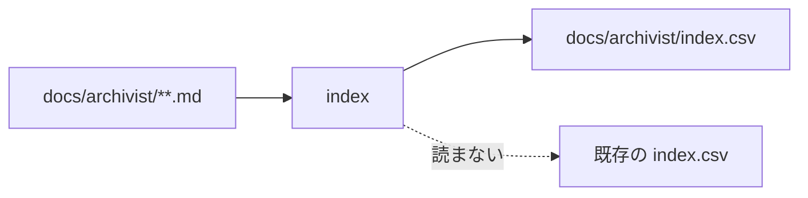

# index — 索引の設計

## Parts

| No | target_name | target_file | IN | OUT |
| -- | ----------- | ----------- | -- | --- |
| T1 | index | skills/archivist-index/SKILL.md | docs/archivist/ の全文書 | 索引の全体 |
| T2 | csv | docs/archivist/index.csv | 索引の全体 | 文書1枚1行の表 |

### Relation

## Rules
- 走査で組む。既存の索引を入力にしない
- 書き出しは全置換。行の追記も差し替えもしない
- 印の有無はファイル名の先頭の `_` から読む。実現先の実在は見に行かない
- 参照はリンクの指し先をそのまま持ち、`docs/archivist/` からの相対で揃える
- 索引自身は行を持たない。文書ではないため

## Verify

| No | VERIFY_NAME | TARGET |
| -- | ----------- | ------ |
| 1 | V1 入力の限定 | T1 |
| 2 | V2 全置換の書き出し | T1 |
| 3 | V3 印の読み取り | T1 |
| 4 | V4 パスの基点 | T2 |
| 5 | V5 索引自身の除外 | T2 |

### V1 入力の限定

- Means: checklist
- 既存の索引を読まないと `SKILL.md` に書かれていることを見る

### V2 全置換の書き出し

- Means: checklist
- 差分を当てず全体を書き直すと `SKILL.md` に書かれていることを見る

### V3 印の読み取り

- Means: checklist
- 印をファイル名から読み、実現先を見に行かないと `SKILL.md` に書かれていることを見る

### V4 パスの基点

- Means: checklist
- 索引の中のパスが `docs/archivist/` を基点に揃っていることを見る

### V5 索引自身の除外

- Means: checklist
- `index.csv` を指す行が索引に無いことを見る

## Articles
- [生成される索引は層に属さない](../L4_articles/index-outside-layers.md)
- [索引は点を1行とする](../L4_articles/index-rows-are-nodes.md)
- [参照はファイル単位で張る](../L4_articles/references-are-file-scoped.md)
- [配布物は英語で書く](../L4_articles/distributed-content-in-english.md)
- [テンプレートはスキルが持つ](../L4_articles/template-belongs-to-skill.md)

## References

### Structures

- [directory-layout](../L3_structures/directory-layout.md)
- [skill-composition](../L3_structures/skill-composition.md)

### Terms

- [index](../L3_terms/index.md)
- [mark](../L3_terms/mark.md)
- [reference](../L3_terms/reference.md)
