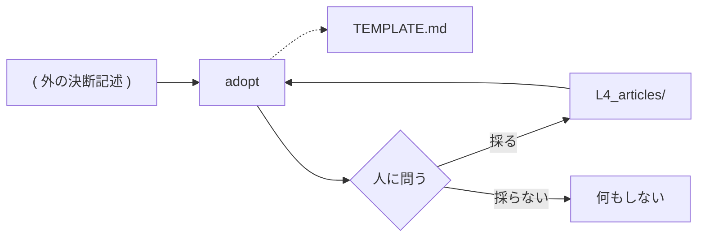

# adopt — 取り込みの設計

## Parts

| No | target_name | target_file | IN | OUT |
| -- | ----------- | ----------- | -- | --- |
| T1 | adopt | skills/archivist-adopt/SKILL.md | 決断記述の並ぶディレクトリ | L4_articles/ARTICLE_NAME.md |
| T2 | template | skills/archivist-adopt/TEMPLATE.md | — | 決断の書式 |

### Relation

## Rules

- 書き込みは提示と回答の後にだけ起きる
    - Details: 突き合わせの途中で一枚も置かない。回答が無いまま終えたら `L4_articles/` は変わらない
- 人が書いた決断を上書きしない
    - Details: 名前が衝突したら、その一枚を飛ばして報告する。連番を付けて逃げない
- 書くのは `L4_articles/` の中だけ
    - Details: 上層は archivist が書く。取り込みは一層も上げない
- 原文を写さず、型紙に整える
    - Details: 原文の場所は Decisions ではなく報告に載る。文書は元本の複製にならない

## Verify

| No | VERIFY_NAME | TARGET |
| -- | ----------- | ------ |
| 1 | V1 書き込みの条件 | T1 |
| 2 | V2 型紙の欄 | T2 |

### V1 書き込みの条件

- Means: checklist
- 書き込みが提示と回答の後にだけ起きると `SKILL.md` に書かれていることを見る
- 名前の衝突では飛ばして報告し、連番を付けないと書かれていることを見る
- 書く先が `L4_articles/` だけであると書かれていることを見る

### V2 型紙の欄

- Means: checklist
- `TEMPLATE.md` が原文の複製ではなく整形された決断の形を持つことを見る

## Articles
- [取り込みの入力は決断記述が並ぶディレクトリ](../L4_articles/adoption-input-is-a-directory.md)
- [取り込むかどうかは人が答える](../L4_articles/adoption-needs-consent.md)
- [決断の取り込みは archivist の外に置く](../L4_articles/adoption-outside-archivist.md)
- [テンプレートはスキルの中に置く](../L4_articles/template-belongs-to-skill.md)
- [配布物は英語で書く](../L4_articles/distributed-content-in-english.md)

## References

### Structures

- [skill-composition](../L3_structures/skill-composition.md)
- [directory-layout](../L3_structures/directory-layout.md)

### Terms

- [adoption](../L3_terms/adoption.md)
- [decision](../L3_terms/decision.md)
