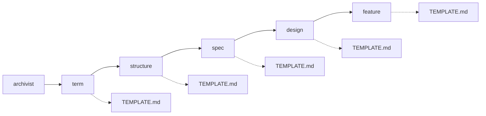

# archivist — 還元の設計

## Needs

| spec | needs |
| ---- | ----- |
| [R1](../L2_specs/archivist.md#R1) | L4_decisions を読み、与えられた範囲に絞る手 |
| [R2](../L2_specs/archivist.md#R2) | 層ごとのスキルと、それを順に呼ぶ側 |
| [R3](../L2_specs/archivist.md#R3) | 導けない箇所で止まり、何が足りないかを述べる口 |
| [R4](../L2_specs/archivist.md#R4) | 既存文書を読み、決断と突き合わせる手 |
| [R5](../L2_specs/archivist.md#R5) | 生成した文書に Decisions 節を書く手 |
| [R6](../L2_specs/archivist.md#R6) | L4_decisions の空を見て、取り込みの名を告げる口 |

## Parts

| target_name | target_file | IN | OUT |
| ----------- | ----------- | -- | --- |
| archivist | skills/archivist/SKILL.md | 決断の集合 | 下位スキルの起動 |
| term | skills/archivist-term/SKILL.md | 決断 | L3_terms/TERM_NAME.md |
| structure | skills/archivist-structure/SKILL.md | 決断, 語 | L3_structures/STRUCTURE_NAME.md |
| spec | skills/archivist-spec/SKILL.md | 決断, L3 | L2_specs/SPEC_NAME.md |
| design | skills/archivist-design/SKILL.md | 決断, L3, spec | L2_designs/DESIGN_NAME.md |
| feature | skills/archivist-feature/SKILL.md | 決断, L2 | L1_features/FEATURE_NAME.md |

### Relation

## Rules

- 下位スキルは1回の起動で1ファイルだけ書く
    - Details: 複数枚に及ぶ還元は、archivist が繰り返し呼ぶ
- 下位スキルは自分の層より上を読まない
    - Details: term は decisions だけを見る。design は decisions と L3 と spec を見る
- 書式は各スキルの TEMPLATE.md にある。SKILL.md に写さない
    - Details: archivist はテンプレートを持たない。文書を書くのは下位スキルになる
- 取り込みは Relation に載せず、名を告げるだけにする
    - Details: 起動順の外にあり、archivist が呼ぶ相手ではない

## Decisions
- [テンプレートはスキルの中に置く](../L4_decisions/template-belongs-to-skill.md)
- [機能が何かは決断であり、下層の要約ではない](../L4_decisions/features-come-from-decisions.md)
- [スキルは文書の要素ごとに割る](../L4_decisions/skill-per-element.md)
- [還元はするが、決断はしない](../L4_decisions/reduction-not-decision.md)
- [決断の取り込みは archivist の外に置く](../L4_decisions/adoption-outside-archivist.md)

## References

### Designs

- [term](term.md)
- [structure](structure.md)
- [spec](spec.md)
- [design](design.md)
- [feature](feature.md)
- [check](check.md)
- [promote](promote.md)
- [adopt](adopt.md)

### Structures

- [skill-composition](../L3_structures/skill-composition.md)
- [directory-layout](../L3_structures/directory-layout.md)
- [document-layers](../L3_structures/document-layers.md)

### Terms

- [reduction](../L3_terms/reduction.md)
- [decision](../L3_terms/decision.md)
- [adoption](../L3_terms/adoption.md)
