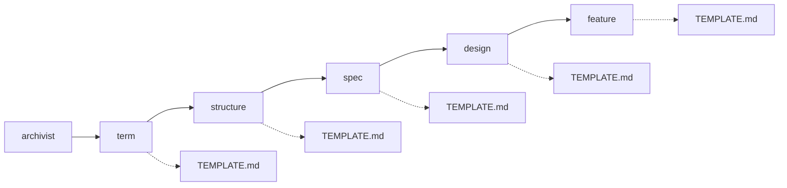

# archivist — 還元の設計

## Parts

| No | target_name | target_file | IN | OUT |
| -- | ----------- | ----------- | -- | --- |
| T1 | archivist | skills/archivist/SKILL.md | 決断の集合 | 下位スキルの起動 |
| T2 | term | skills/archivist-term/SKILL.md | 決断 | L3_terms/TERM_NAME.md |
| T3 | structure | skills/archivist-structure/SKILL.md | 決断, 語 | L3_structures/STRUCTURE_NAME.md |
| T4 | spec | skills/archivist-spec/SKILL.md | 決断, L3 | L2_specs/SPEC_NAME.md |
| T5 | design | skills/archivist-design/SKILL.md | 決断, L3 | L2_designs/DESIGN_NAME.md |
| T6 | feature | skills/archivist-feature/SKILL.md | 決断, L2 | L1_features/FEATURE_NAME.md |

### Relation

## Rules

- 下位スキルは1回の起動で1ファイルだけ書く
    - Details: 複数枚に及ぶ還元は、archivist が繰り返し呼ぶ
- 下位スキルは自分の層より上を読まない
    - Details: term は decisions だけを見る。spec と design はどちらも decisions と L3 だけを見る
- 書式は各スキルの TEMPLATE.md にある。SKILL.md に写さない
    - Details: archivist はテンプレートを持たない。文書を書くのは下位スキルになる
- 取り込みは Relation に載せず、名を告げるだけにする
    - Details: 起動順の外にあり、archivist が呼ぶ相手ではない

## Verify

| No | VERIFY_NAME | TARGET |
| -- | ----------- | ------ |
| 1 | [起動順](#V1) | [T1](#T1) |
| 2 | [下位スキルの独立](#V2) | [T2](#T2) |
| 3 | [spec の入力](#V3) | [T4](#T4) |
| 4 | [design の入力](#V4) | [T5](#T5) |
| 5 | [feature の合流](#V5) | [T6](#T6) |

### V1 起動順

- Means: checklist
- `SKILL.md` の Order が term, structure, spec, design, feature を挙げることを見る
- spec と design が同じ段に置かれ、互いを待たないと書かれていることを見る

### V2 下位スキルの独立

- Means: checklist
- term の What to read が決断だけであることを見る

### V3 spec の入力

- Means: checklist
- spec の入力に design が含まれていないことを見る

### V4 design の入力

- Means: checklist
- design の入力に spec が含まれていないことを見る

### V5 feature の合流

- Means: checklist
- feature の入力に L2 の両方が含まれ、Coverage 表を書くことになっていることを見る

## Decisions
- [spec と design は互いを引かない](../L4_decisions/spec-design-independent.md)
- [テンプレートはスキルの中に置く](../L4_decisions/template-belongs-to-skill.md)
- [機能が何かは決断であり、下層の要約ではない](../L4_decisions/features-come-from-decisions.md)
- [スキルは文書の要素ごとに割る](../L4_decisions/skill-per-element.md)
- [還元はするが、決断はしない](../L4_decisions/reduction-not-decision.md)
- [決断の取り込みは archivist の外に置く](../L4_decisions/adoption-outside-archivist.md)

## References

### Designs

- [term](term.md)
- [structure](structure.md)
- [spec](spec.md)
- [design](design.md)
- [feature](feature.md)
- [check](check.md)
- [promote](promote.md)
- [adopt](adopt.md)

### Structures

- [skill-composition](../L3_structures/skill-composition.md)
- [directory-layout](../L3_structures/directory-layout.md)
- [document-layers](../L3_structures/document-layers.md)

### Terms

- [reduction](../L3_terms/reduction.md)
- [decision](../L3_terms/decision.md)
- [adoption](../L3_terms/adoption.md)
