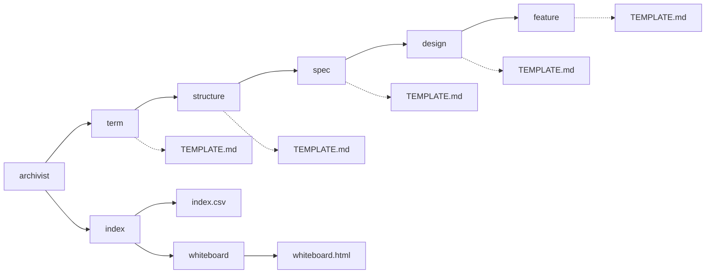

# archivist — 還元の設計

## Parts

| No | target_name | target_file | IN | OUT |
| -- | ----------- | ----------- | -- | --- |
| T1 | archivist | skills/archivist/SKILL.md | 条項の集合 | 下位スキルの起動 |
| T2 | term | skills/archivist-term/SKILL.md | 条項 | L3_terms/TERM_NAME.md |
| T3 | structure | skills/archivist-structure/SKILL.md | 条項, 語 | L3_structures/STRUCTURE_NAME.md |
| T4 | spec | skills/archivist-spec/SKILL.md | 条項, L3 | L2_specs/SPEC_NAME.md |
| T5 | design | skills/archivist-design/SKILL.md | 条項, L3 | L2_designs/DESIGN_NAME.md |
| T6 | feature | skills/archivist-feature/SKILL.md | 条項, L2 | L1_features/FEATURE_NAME.md |
| T7 | index | skills/archivist-index/SKILL.md | 全文書 | docs/archivist/index.csv |
| T8 | whiteboard | skills/archivist-whiteboard/SKILL.md | 全文書, 索引 | docs/archivist/whiteboard.html |

### Relation

## Rules

- 下位スキルは1回の起動で1ファイルだけ書く
    - Details: 複数枚に及ぶ還元は、archivist が繰り返し呼ぶ
- 組み直しの後に索引を呼ぶ。最後の1回だけで、文書1枚ごとには呼ばない
    - Details: 索引は生成物なので、呼ぶことは索引への依存にならない
- 索引の直後に盤面を呼び、それを最終段とする。こちらも最後の1回だけ
    - Details: 盤面は層に属さず、index と同じく全層を読み、どの層にも書かない
- 下位スキルは自分の層より上を読まない
    - Details: term は articles だけを見る。spec と design はどちらも articles と L3 だけを見る
    - Details: index は層に属さないのでこの規則の外になる。全層を読み、どの層にも書かない
- 書式は各スキルの TEMPLATE.md にある。SKILL.md に写さない
    - Details: archivist はテンプレートを持たない。文書を書くのは下位スキルになる
- 取り込みは Relation に載せず、名を告げるだけにする
    - Details: 起動順の外にあり、archivist が呼ぶ相手ではない

## Verify

| No | VERIFY_NAME | TARGET |
| -- | ----------- | ------ |
| 1 | V1 起動順 | T1, T7, T8 |
| 2 | V2 下位スキルの独立 | T2 |
| 3 | V3 spec の入力 | T4 |
| 4 | V4 design の入力 | T5 |
| 5 | V5 feature の合流 | T6 |

### V1 起動順

- Means: checklist
- `SKILL.md` の Order が term, structure, spec, design, feature を挙げることを見る
- spec と design が同じ段に置かれ、互いを待たないと書かれていることを見る
- 組み直しの後に索引が1回だけ呼ばれると `SKILL.md` に書かれていることを見る
- 索引の直後に盤面が1回だけ呼ばれ、それが最後であると `SKILL.md` に書かれていることを見る

### V2 下位スキルの独立

- Means: checklist
- term の What to read が条項だけであることを見る

### V3 spec の入力

- Means: checklist
- spec の入力に design が含まれていないことを見る

### V4 design の入力

- Means: checklist
- design の入力に spec が含まれていないことを見る

### V5 feature の合流

- Means: checklist
- feature の入力に L2 の両方が含まれ、Coverage 表を書くことになっていることを見る

## Articles
- [生成される索引は層に属さない](../L4_articles/index-outside-layers.md)
- [ホワイトボードは還元の最後に、索引の後で組み直す](../L4_articles/whiteboard-follows-index.md)
- [spec と design は互いを引かない](../L4_articles/spec-design-independent.md)
- [テンプレートはスキルの中に置く](../L4_articles/template-belongs-to-skill.md)
- [機能が何かは条項であり、下層の要約ではない](../L4_articles/features-come-from-articles.md)
- [スキルは文書の要素ごとに割る](../L4_articles/skill-per-element.md)
- [還元はするが、条項は立てない](../L4_articles/reduction-not-article.md)
- [条項の取り込みは archivist の外に置く](../L4_articles/adoption-outside-archivist.md)

## References

### Designs

- [term](term.md)
- [structure](structure.md)
- [spec](spec.md)
- [design](design.md)
- [feature](feature.md)
- [check](check.md)
- [adopt](adopt.md)
- [index](index.md)
- [whiteboard](whiteboard.md)

### Structures

- [skill-composition](../L3_structures/skill-composition.md)
- [directory-layout](../L3_structures/directory-layout.md)
- [document-layers](../L3_structures/document-layers.md)

### Terms

- [reduction](../L3_terms/reduction.md)
- [article](../L3_terms/article.md)
- [adoption](../L3_terms/adoption.md)
