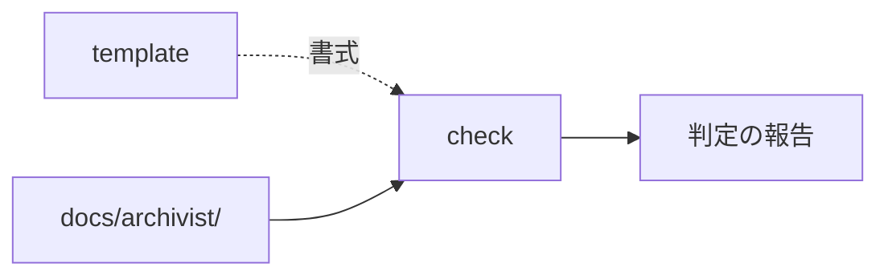

# check — 検査の設計

## Parts

| No | target_name | target_file | IN | OUT |
| -- | ----------- | ----------- | -- | --- |
| T1 | check | skills/archivist-check/SKILL.md | 条項, docs/archivist/ | 判定の報告 |
| T2 | docs | docs/archivist/ | 全文書 | 走査の対象 |

### Relation

## Rules
- 書き込みを一切行わない
- 報告は promote がそのまま食える形で出す

## Verify

| No | VERIFY_NAME | TARGET |
| -- | ----------- | ------ |
| 1 | V1 無変更 | T1 |
| 2 | V2 報告の形 | T2 |

### V1 無変更

- Means: checklist
- `SKILL.md` が書き込みを行わないと明記していることを見る
- 判定の一覧に、書き換えを伴う項目が無いことを見る

### V2 報告の形

- Means: checklist
- 報告が promote の入力の形であると `SKILL.md` に書かれていることを見る

## Articles
- [debug は spec だけを読んで書ける](../L4_articles/debug-from-spec-alone.md)
- [test は design を読んで書く](../L4_articles/test-from-design.md)
- [spec と design の整合を担保するのは feature だけ](../L4_articles/feature-joins-spec-and-design.md)
- [印が付くのは実現先を持つ層だけ](../L4_articles/mark-only-where-realized.md)
- [検証は自分の手段を宣言する](../L4_articles/verification-declares-its-means.md)
- [`_` を外す作業は check から分ける](../L4_articles/promote-separate-from-check.md)

## References

### Structures

- [document-layers](../L3_structures/document-layers.md)
- [skill-composition](../L3_structures/skill-composition.md)
- [directory-layout](../L3_structures/directory-layout.md)

### Terms

- [reference](../L3_terms/reference.md)
- [layer](../L3_terms/layer.md)
