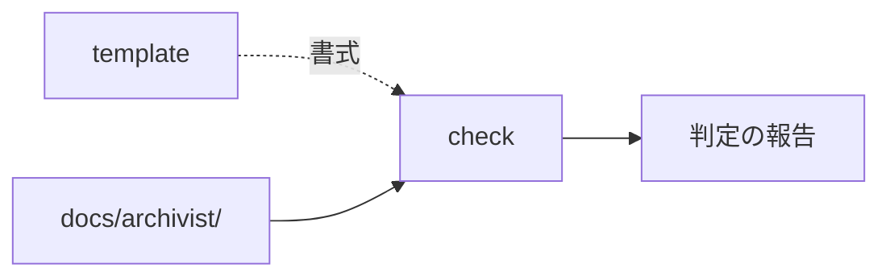

# check — 検査の設計

## Needs

| spec | needs |
| ---- | ----- |
| [R1](../L2_specs/check.md#R1) | 相対パスとアンカーの実在を確かめる手 |
| [R2](../L2_specs/check.md#R2) | 参照の行き先の層を求める手 |
| [R3](../L2_specs/check.md#R3) | ノード内の参照から閉路を探す手 |
| [R4](../L2_specs/check.md#R4) | `_` 付き文書の実現先の実在を判定する手 |
| [R5](../L2_specs/check.md#R5) | 読むだけに留める仕組み |
| [R6](../L2_specs/check.md#R6) | V が design を前提にしていないか確かめる手 |
## Parts

| target_name | target_file | IN | OUT |
| ----------- | ----------- | -- | --- |
| check | skills/archivist-check/SKILL.md | 決断, docs/archivist/ | 判定の報告 |
| docs | docs/archivist/ | 全文書 | 走査の対象 |

### Relation

## Rules
- 書き込みを一切行わない
- 報告は promote がそのまま食える形で出す

## Decisions
- [印が付くのは実現先を持つ層だけ](../L4_decisions/mark-only-where-realized.md)
- [検証は自分の手段を宣言する](../L4_decisions/verification-declares-its-means.md)
- [テストコードは spec だけを読んで書ける](../L4_decisions/test-from-spec-alone.md)
- [`_` を外す作業は check から分ける](../L4_decisions/promote-separate-from-check.md)

## References

### Structures

- [document-layers](../L3_structures/document-layers.md)
- [skill-composition](../L3_structures/skill-composition.md)
- [directory-layout](../L3_structures/directory-layout.md)

### Terms

- [reference](../L3_terms/reference.md)
- [layer](../L3_terms/layer.md)
