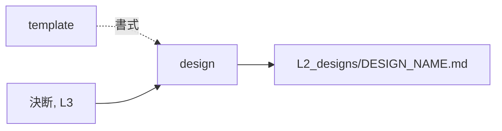

# design — 設計を起こす設計

## Parts

| No | target_name | target_file | IN | OUT |
| -- | ----------- | ----------- | -- | --- |
| T1 | design | skills/archivist-design/SKILL.md | 決断, L3, spec | L2_designs/DESIGN_NAME.md |
| T2 | template | skills/archivist-design/TEMPLATE.md | - | 書式 |
| T3 | l3 | docs/archivist/L3_*/ | 語と構造 | 参照先 |

### Relation

## Rules
- 仕様を引かない。仕様の側からも引かれない
- 1回の起動で1ファイルだけ書く

## Verify

| No | VERIFY_NAME | TARGET |
| -- | ----------- | ------ |
| 1 | [スキルの入力範囲](#V1) | [T1](#T1) |
| 2 | [型紙の錨と検証欄](#V2) | [T2](#T2) |
| 3 | [語と構造の参照先](#V3) | [T3](#T3) |

### V1 スキルの入力範囲

- Means: checklist
- `SKILL.md` の What to read が決断と L3 だけを挙げ、`L2_specs/` を挙げていないことを見る
- spec を引かないことが Reference direction に書かれていることを見る

### V2 型紙の錨と検証欄

- Means: checklist
- `TEMPLATE.md` の Parts が `T1`, `T2`, ... の No 列と `<a id>` を持つことを見る
- `TEMPLATE.md` に Needs の欄が無いことを見る
- Verify の注記が test を宛先として名指し、spec を引くなと述べていることを見る

### V3 語と構造の参照先

- Means: checklist
- `docs/archivist/L3_*/` が入力として `SKILL.md` に挙がっていることを見る

## Decisions
- [test は design を読んで書く](../L4_decisions/test-from-design.md)
- [spec と design は互いを引かない](../L4_decisions/spec-design-independent.md)
- [生成する文書の言語は対象プロジェクトに合わせる](../L4_decisions/output-language-follows-project.md)
- [配布物は英語で書く](../L4_decisions/distributed-content-in-english.md)
- [テンプレートはスキルの中に置く](../L4_decisions/template-belongs-to-skill.md)
- [スキルは文書の要素ごとに割る](../L4_decisions/skill-per-element.md)
- [層は飛ばさない。decisions だけが例外](../L4_decisions/no-layer-skip.md)

## References

### Structures

- [document-layers](../L3_structures/document-layers.md)
- [skill-composition](../L3_structures/skill-composition.md)
- [language-split](../L3_structures/language-split.md)
- [directory-layout](../L3_structures/directory-layout.md)

### Terms

- [reference](../L3_terms/reference.md)
- [layer](../L3_terms/layer.md)
