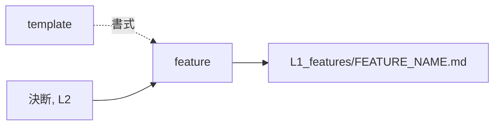

# feature — 機能を起こす設計

## Needs

| spec | needs |
| ---- | ----- |
| [R1](../L2_specs/feature.md#R1) | 決断から名指しできる単位を切り出す手 |
| [R2](../L2_specs/feature.md#R2) | コマンドの集合と突き合わせる手 |
| [R3](../L2_specs/feature.md#R3) | できることを箇条書きに落とす手 |
| [R4](../L2_specs/feature.md#R4) | 仕様と設計を参照として張る手 |
| [R5](../L2_specs/feature.md#R5) | 既存の文書から言語を見分ける手 |
## Parts

| target_name | target_file | IN | OUT |
| ----------- | ----------- | -- | --- |
| feature | skills/archivist-feature/SKILL.md | 決断, L2 | L1_features/FEATURE_NAME.md |
| template | skills/archivist-feature/TEMPLATE.md | - | 書式 |
| skills | skills/ | 起動できるコマンド | 対応の照合先 |

### Relation

## Rules
- 仕様と設計の要約にしない。起点は決断に置く
- 1回の起動で1ファイルだけ書く

## Decisions
- [生成する文書の言語は対象プロジェクトに合わせる](../L4_decisions/output-language-follows-project.md)
- [配布物は英語で書く](../L4_decisions/distributed-content-in-english.md)
- [テンプレートはスキルの中に置く](../L4_decisions/template-belongs-to-skill.md)
- [コマンド1本を feature 1枚とする](../L4_decisions/command-is-feature.md)
- [機能が何かは決断であり、下層の要約ではない](../L4_decisions/features-come-from-decisions.md)

## References

### Structures

- [document-layers](../L3_structures/document-layers.md)
- [skill-composition](../L3_structures/skill-composition.md)
- [language-split](../L3_structures/language-split.md)
- [directory-layout](../L3_structures/directory-layout.md)

### Terms

- [feature](../L3_terms/feature.md)
- [decision](../L3_terms/decision.md)
