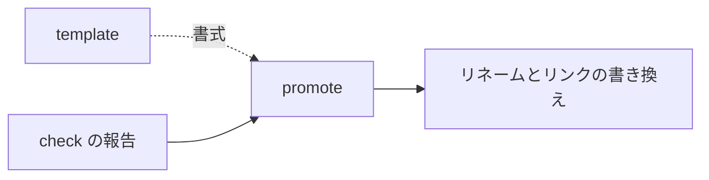

# promote — 印を外す設計

## Parts

| No | target_name | target_file | IN | OUT |
| -- | ----------- | ----------- | -- | --- |
| T1 | promote | skills/archivist-promote/SKILL.md | check の報告 | リネームとリンクの書き換え |
| T2 | docs | docs/archivist/ | 全文書 | 流入リンクの走査対象 |

### Relation

## Rules
- 実現先の実在は自分で判定しない。報告に従う
- 索引を持たないため、走査で流入リンクを見つける

## Verify

| No | VERIFY_NAME | TARGET |
| -- | ----------- | ------ |
| 1 | V1 判定の委譲 | T1 |
| 2 | V2 流入リンクの走査 | T2 |

### V1 判定の委譲

- Means: checklist
- 実現先の実在を自分で判定しないと `SKILL.md` に書かれていることを見る

### V2 流入リンクの走査

- Means: checklist
- 索引を持たず走査で流入リンクを見つけると `SKILL.md` に書かれていることを見る

## Articles
- [`_` を外す作業は check から分ける](../L4_articles/promote-separate-from-check.md)

## References

### Structures

- [document-layers](../L3_structures/document-layers.md)
- [skill-composition](../L3_structures/skill-composition.md)
- [directory-layout](../L3_structures/directory-layout.md)

### Terms

- [reference](../L3_terms/reference.md)
