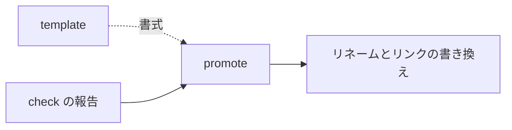

# promote — 印を外す設計

## Needs

| spec | needs |
| ---- | ----- |
| [R1](../L2_specs/promote.md#R1) | 報告から対象ファイルを読み取る手 |
| [R2](../L2_specs/promote.md#R2) | リネームと、流入リンクの走査置換を行う手 |
| [R3](../L2_specs/promote.md#R3) | 報告に無いものを除く手 |

## Parts

| target_name | target_file | IN | OUT |
| ----------- | ----------- | -- | --- |
| promote | skills/archivist-promote/SKILL.md | check の報告 | リネームとリンクの書き換え |
| docs | docs/archivist/ | 全文書 | 流入リンクの走査対象 |

### Relation

## Rules
- 実現先の実在は自分で判定しない。報告に従う
- 索引を持たないため、走査で流入リンクを見つける

## Decisions
- [`_` を外す作業は check から分ける](../L4_decisions/promote-separate-from-check.md)

## References

### Structures

- [document-layers](../L3_structures/document-layers.md)
- [skill-composition](../L3_structures/skill-composition.md)
- [directory-layout](../L3_structures/directory-layout.md)

### Terms

- [reference](../L3_terms/reference.md)
