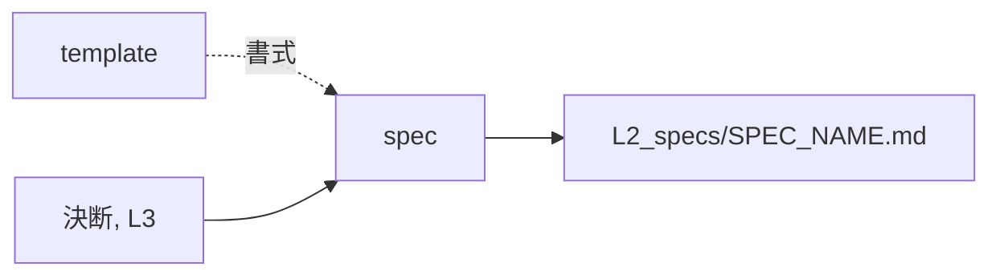

# spec — 仕様を起こす設計

## Needs

| spec | needs |
| ---- | ----- |
| [R1](../L2_specs/spec.md#R1) | 決断から観測可能な約束を切り出す手 |
| [R2](../L2_specs/spec.md#R2) | 要件にアンカーを振る手 |
| [R3](../L2_specs/spec.md#R3) | 各要件に対する判定手順を書く手 |
| [R4](../L2_specs/spec.md#R4) | 要件と検証の対応表を組む手 |
| [R5](../L2_specs/spec.md#R5) | 観測できる語彙と内部の作りを切り分ける手 |
## Parts

| target_name | target_file | IN | OUT |
| ----------- | ----------- | -- | --- |
| spec | skills/archivist-spec/SKILL.md | 決断, L3 | L2_specs/SPEC_NAME.md |
| template | skills/archivist-spec/TEMPLATE.md | - | 書式 |
| l3 | docs/archivist/L3_*/ | 語と構造 | 参照先 |

### Relation

## Rules
- 内部の作りに触れそうになったら design に回す
- 1回の起動で1ファイルだけ書く

## Decisions
- [生成する文書の言語は対象プロジェクトに合わせる](../L4_decisions/output-language-follows-project.md)
- [配布物は英語で書く](../L4_decisions/distributed-content-in-english.md)
- [検証は自分の手段を宣言する](../L4_decisions/verification-declares-its-means.md)
- [テンプレートはスキルの中に置く](../L4_decisions/template-belongs-to-skill.md)
- [テストコードは spec だけを読んで書ける](../L4_decisions/test-from-spec-alone.md)
- [スキルは文書の要素ごとに割る](../L4_decisions/skill-per-element.md)

## References

### Structures

- [document-layers](../L3_structures/document-layers.md)
- [skill-composition](../L3_structures/skill-composition.md)
- [language-split](../L3_structures/language-split.md)
- [directory-layout](../L3_structures/directory-layout.md)

### Terms

- [decision](../L3_terms/decision.md)
- [reference](../L3_terms/reference.md)
