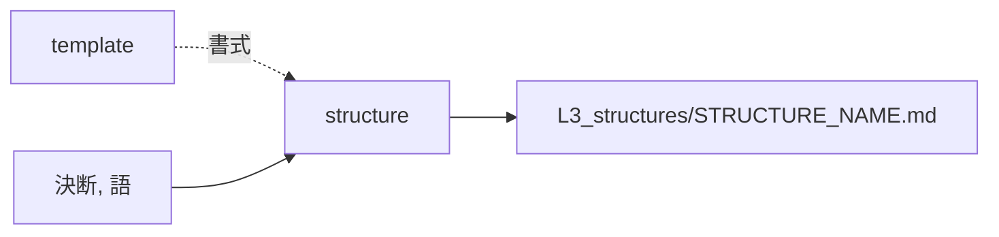

# structure — 構造を起こす設計

## Parts

| No | target_name | target_file | IN | OUT |
| -- | ----------- | ----------- | -- | --- |
| T1 | structure | skills/archivist-structure/SKILL.md | 決断, 語 | L3_structures/STRUCTURE_NAME.md |
| T2 | template | skills/archivist-structure/TEMPLATE.md | - | 書式 |
| T3 | terms | docs/archivist/L3_terms/ | 既存の語 | 図に使える語の集合 |

### Relation

## Rules
- 台帳に無い語が要るときは書かずに止まる
- 1回の起動で1ファイルだけ書く

## Verify

| No | VERIFY_NAME | TARGET |
| -- | ----------- | ------ |
| 1 | V1 スキルの停止条件 | T1 |
| 2 | V2 型紙の欄 | T2 |
| 3 | V3 語の台帳 | T3 |

### V1 スキルの停止条件

- Means: checklist
- 台帳に無い語が要るときは書かずに止まる、と `SKILL.md` に書かれていることを見る

### V2 型紙の欄

- Means: checklist
- `TEMPLATE.md` が図と、その図が何であるかを述べる散文の欄を対で持つことを見る

### V3 語の台帳

- Means: checklist
- `docs/archivist/L3_terms/` が入力として `SKILL.md` に挙がっていることを見る

## Articles
- [生成する文書の言語は対象プロジェクトに合わせる](../L4_articles/output-language-follows-project.md)
- [配布物は英語で書く](../L4_articles/distributed-content-in-english.md)
- [テンプレートはスキルの中に置く](../L4_articles/template-belongs-to-skill.md)
- [スキルは文書の要素ごとに割る](../L4_articles/skill-per-element.md)
- [層は飛ばさない。decisions だけが例外](../L4_articles/no-layer-skip.md)

## References

### Structures

- [document-layers](../L3_structures/document-layers.md)
- [skill-composition](../L3_structures/skill-composition.md)
- [language-split](../L3_structures/language-split.md)
- [directory-layout](../L3_structures/directory-layout.md)

### Terms

- [layer](../L3_terms/layer.md)
- [reference](../L3_terms/reference.md)
