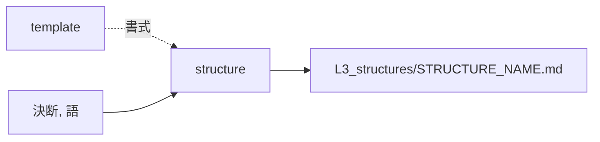

# structure — 構造を起こす設計

## Needs

| spec | needs |
| ---- | ----- |
| [R1](../L2_specs/structure.md#R1) | 決断が課した制約を、図の種類に振り分ける手 |
| [R2](../L2_specs/structure.md#R2) | 図に使う語が L3_terms に在るかを確かめる手 |
| [R3](../L2_specs/structure.md#R3) | design を捨てても残るかを判定する手 |
| [R4](../L2_specs/structure.md#R4) | 図ごとにアンカーを振る手 |
| [R5](../L2_specs/structure.md#R5) | 既存の文書から言語を見分ける手 |
## Parts

| target_name | target_file | IN | OUT |
| ----------- | ----------- | -- | --- |
| structure | skills/archivist-structure/SKILL.md | 決断, 語 | L3_structures/STRUCTURE_NAME.md |
| template | skills/archivist-structure/TEMPLATE.md | - | 書式 |
| terms | docs/archivist/L3_terms/ | 既存の語 | 図に使える語の集合 |

### Relation

## Rules
- 台帳に無い語が要るときは書かずに止まる
- 1回の起動で1ファイルだけ書く

## Decisions
- [生成する文書の言語は対象プロジェクトに合わせる](../L4_decisions/output-language-follows-project.md)
- [配布物は英語で書く](../L4_decisions/distributed-content-in-english.md)
- [テンプレートはスキルの中に置く](../L4_decisions/template-belongs-to-skill.md)
- [スキルは文書の要素ごとに割る](../L4_decisions/skill-per-element.md)
- [層は飛ばさない。decisions だけが例外](../L4_decisions/no-layer-skip.md)

## References

### Structures

- [document-layers](../L3_structures/document-layers.md)
- [skill-composition](../L3_structures/skill-composition.md)
- [language-split](../L3_structures/language-split.md)
- [directory-layout](../L3_structures/directory-layout.md)

### Terms

- [layer](../L3_terms/layer.md)
- [reference](../L3_terms/reference.md)
