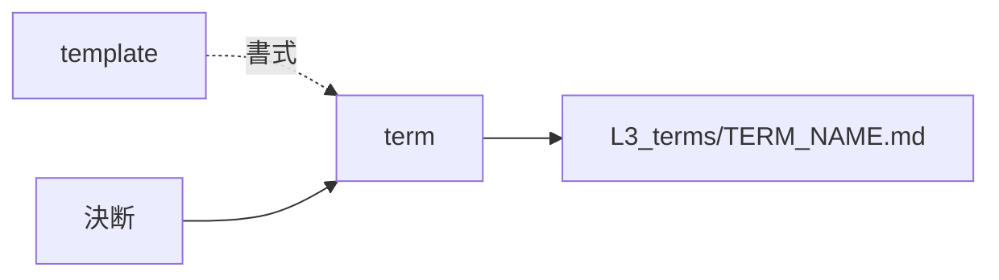

# term — 語を起こす設計

## Parts

| No | target_name | target_file | IN | OUT |
| -- | ----------- | ----------- | -- | --- |
| T1 | term | skills/archivist-term/SKILL.md | 決断 | L3_terms/TERM_NAME.md |
| T2 | template | skills/archivist-term/TEMPLATE.md | - | 書式 |
| T3 | terms | docs/archivist/L3_terms/ | 既存の語 | 書き直しの対象 |

### Relation

## Rules
- 決断だけを見る。上層は読まない
- 1回の起動で1ファイルだけ書く

## Verify

| No | VERIFY_NAME | TARGET |
| -- | ----------- | ------ |
| 1 | V1 スキルの入力範囲 | T1 |
| 2 | V2 型紙の欄 | T2 |

### V1 スキルの入力範囲

- Means: checklist
- `SKILL.md` の What to read が `L4_decisions/` だけを挙げ、上層のディレクトリを挙げていないことを見る

### V2 型紙の欄

- Means: checklist
- `TEMPLATE.md` が Definition, Aliases, Details, Terms, Decisions の欄を全て持つことを見る
- 一語一ファイルであることが型紙の注記に書かれていることを見る

## Decisions
- [生成する文書の言語は対象プロジェクトに合わせる](../L4_decisions/output-language-follows-project.md)
- [配布物は英語で書く](../L4_decisions/distributed-content-in-english.md)
- [テンプレートはスキルの中に置く](../L4_decisions/template-belongs-to-skill.md)
- [スキルは文書の要素ごとに割る](../L4_decisions/skill-per-element.md)

## References

### Structures

- [document-layers](../L3_structures/document-layers.md)
- [skill-composition](../L3_structures/skill-composition.md)
- [language-split](../L3_structures/language-split.md)
- [directory-layout](../L3_structures/directory-layout.md)

### Terms

- [decision](../L3_terms/decision.md)
- [reduction](../L3_terms/reduction.md)
