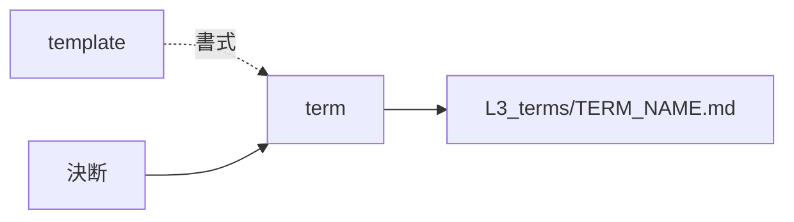

# term — 語を起こす設計

## Needs

| spec | needs |
| ---- | ----- |
| [R1](../L2_specs/term.md#R1) | 決断文から語を拾い、意味が確定されたかを判定する手 |
| [R2](../L2_specs/term.md#R2) | ファイル名を語そのものから決める手 |
| [R3](../L2_specs/term.md#R3) | 既存の語を読み、決断と突き合わせる手 |
| [R4](../L2_specs/term.md#R4) | Decisions 節を書く手 |
| [R5](../L2_specs/term.md#R5) | 既存の文書から言語を見分ける手 |
## Parts

| target_name | target_file | IN | OUT |
| ----------- | ----------- | -- | --- |
| term | skills/archivist-term/SKILL.md | 決断 | L3_terms/TERM_NAME.md |
| template | skills/archivist-term/TEMPLATE.md | - | 書式 |
| terms | docs/archivist/L3_terms/ | 既存の語 | 書き直しの対象 |

### Relation

## Rules
- 決断だけを見る。上層は読まない
- 1回の起動で1ファイルだけ書く

## Decisions
- [生成する文書の言語は対象プロジェクトに合わせる](../L4_decisions/output-language-follows-project.md)
- [配布物は英語で書く](../L4_decisions/distributed-content-in-english.md)
- [テンプレートはスキルの中に置く](../L4_decisions/template-belongs-to-skill.md)
- [スキルは文書の要素ごとに割る](../L4_decisions/skill-per-element.md)

## References

### Structures

- [document-layers](../L3_structures/document-layers.md)
- [skill-composition](../L3_structures/skill-composition.md)
- [language-split](../L3_structures/language-split.md)
- [directory-layout](../L3_structures/directory-layout.md)

### Terms

- [decision](../L3_terms/decision.md)
- [reduction](../L3_terms/reduction.md)
