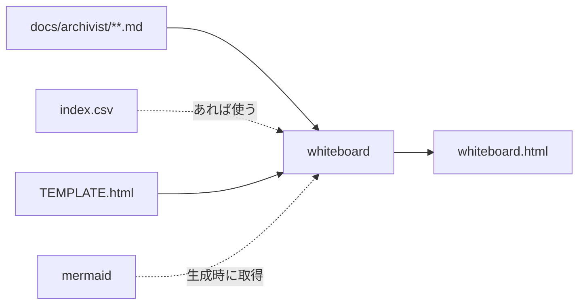

# whiteboard — ホワイトボードの設計

## Parts

| No | target_name | target_file | IN | OUT |
| -- | ----------- | ----------- | -- | --- |
| T1 | whiteboard | skills/archivist-whiteboard/SKILL.md | docs/archivist/ の文書と索引 | 盤面の全体 |
| T2 | template | skills/archivist-whiteboard/TEMPLATE.html | 盤面の骨格と差し込み口 | 出力の器 |
| T3 | html | docs/archivist/whiteboard.html | 盤面の全体 | 1枚で開ける盤面 |

### Relation

## Rules
- 走査で組む。索引は速さのために使い、無ければ文書から組む
- 出力は器に差し込んで作る。器は skill が持ち、出力の構造を決める
- 文書の中身は出力へ埋め込む。閲覧時に文書を読みに行かない
- 図の実装は生成時に取得し、版を固定して出力へ埋め込む
    - 取得元と版を器に書き残し、次の生成で同じ版が入る
    - 取得できなければ図の部分を持たない出力を作る。代わりの描画を持たない
- 配置は座標を返す規則1本として持つ
    - 規則は文書1枚につき `0..1` の座標を1つ返す。盤面の大きさを知らない
    - 規則を足すときは1本足すだけで済む。既存の規則と盤面は書き換えない
    - 既定の配置を1つ選ぶ。既定は盤面を画面より広く取り、全体は引いて見る
- ピンは色と形の表1つを出力に置く
    - 盤面・紙・本文中の参照・凡例の4箇所は、この表だけを読む
    - 色は層に、形は同じ層の中の割れ方に割り当てる
    - 表と別に色や形を書いた場所を作らない
- 紙は盤面の座標に置く。盤面を動かすと一緒に動き、元のノードと線で繋がる
- 紙は何枚でも開ける。開いた紙の並び順は後から開いたものが手前になる
- 視点は盤面の状態として持ち、位置と拡大率の2つで表す
    - 掴む操作は、背景なら視点の位置を、ノードならその点の座標を動かす
    - 拡大はカーソルの座標を固定点に解く。拡大率を直接動かす手段は画面の中心を固定点にする
    - 二つの手段は同じ拡大率を読み書きする。別々の値を持たない
    - 自動追従を持つときは、掴む操作と拡大の操作がそれを解除する
- 配置の切り替えは、点ごとに古い座標から新しい座標への補間として解く
    - 点の同一性を保つ。切り替えで点を作り直さない
    - 補間の最中も操作を受け付ける。完了を待つ状態を持たない
- 既定の視点は、盤面が画面に収まらない拡大率から始める
- 盤面の状態は出力の外へ書き出さない。位置も拡大率も開閉も保存しない
- 生成は `docs/archivist/` の `.md` を開くだけで、書き込まない

## Verify

| No | VERIFY_NAME | TARGET |
| -- | ----------- | ------ |
| 1 | V1 入力の走査 | T1 |
| 2 | V2 索引の任意性 | T1 |
| 3 | V3 取得と埋め込み | T1, T2 |
| 4 | V4 版の固定 | T2 |
| 5 | V5 配置の規則の形 | T2 |
| 6 | V6 ピンの表の単一性 | T2 |
| 7 | V7 紙の追従 | T2 |
| 8 | V8 書き込みの不在 | T1 |
| 9 | V9 出力の自立 | T3 |
| 10 | V10 視点の単一性 | T2 |
| 11 | V11 固定点の解き方 | T2 |
| 12 | V12 切り替えの補間 | T2 |

### V1 入力の走査

- Means: checklist
- `SKILL.md` が入力を `docs/archivist/` の `.md` と `index.csv` に限っていることを見る

### V2 索引の任意性

- Means: checklist
- `SKILL.md` が索引の欠落を許し、文書からの走査で代替すると書いていることを見る

### V3 取得と埋め込み

- Means: checklist
- 図の実装を取得して出力へ埋め込む手順が `SKILL.md` に書かれていることを見る
- 取得できなかったときの分岐が書かれていることを見る

### V4 版の固定

- Means: checklist
- 器に取得元と版が書かれており、版が固定されていることを見る

### V5 配置の規則の形

- Means: checklist
- 器の中の配置が、座標を返す規則1本として分かれていることを見る
- 規則が盤面の大きさを参照していないことを見る

### V6 ピンの表の単一性

- Means: checklist
- 器の中で色と形を決めている箇所が1つだけであることを見る
- 盤面・紙・参照・凡例の描画が、その表を読んでいることを見る

### V7 紙の追従

- Means: checklist
- 紙が盤面の座標を持ち、盤面の移動に追従する作りであることを見る

### V8 書き込みの不在

- Means: checklist
- `SKILL.md` に文書を書き換える手順が無いことを見る

### V9 出力の自立

- Means: checklist
- 出力が他のファイルを参照していないことを見る

### V10 視点の単一性

- Means: checklist
- 器の中で拡大率を持つ場所が1つだけであることを見る
- 掴む操作と拡大の操作が、同じ視点の値を書き換えていることを見る

### V11 固定点の解き方

- Means: checklist
- 拡大の式が、画面の中心ではなくカーソルの座標を固定点に置いていることを見る

### V12 切り替えの補間

- Means: checklist
- 切り替えが、点ごとの座標の補間として書かれていることを見る
- 補間中に操作を止める分岐が無いことを見る

## Articles
- [ホワイトボードは文書から生成され、文書を書き換えない](../L4_articles/whiteboard-generates-from-documents.md)
- [盤面の配置に正解を1つ置かない](../L4_articles/whiteboard-layout-has-no-single-answer.md)
- [ピンは一つの表から引く](../L4_articles/whiteboard-pins-come-from-one-table.md)
- [図は自前で描かない](../L4_articles/whiteboard-diagrams-are-not-ours.md)
- [文書は盤面の上で開く](../L4_articles/whiteboard-documents-open-on-the-board.md)
- [盤面は掴んで動かす](../L4_articles/whiteboard-the-board-is-dragged.md)
- [ズームはカーソルを固定点にする](../L4_articles/whiteboard-zoom-anchors-at-the-cursor.md)
- [配置の切り替えは点の移動で行う](../L4_articles/whiteboard-layout-change-is-a-move.md)
- [盤面は画面より広く開く](../L4_articles/whiteboard-opens-wider-than-the-screen.md)
- [テンプレートはスキルが持つ](../L4_articles/template-belongs-to-skill.md)
- [配布物は英語で書く](../L4_articles/distributed-content-in-english.md)
- [スキルは文書の要素ごとに割る](../L4_articles/skill-per-element.md)

## References

### Structures

- [whiteboard](../L3_structures/whiteboard.md)
- [directory-layout](../L3_structures/directory-layout.md)
- [skill-composition](../L3_structures/skill-composition.md)

### Terms

- [whiteboard](../L3_terms/whiteboard.md)
- [layout](../L3_terms/layout.md)
- [pin](../L3_terms/pin.md)
- [paper](../L3_terms/paper.md)
- [view](../L3_terms/view.md)
