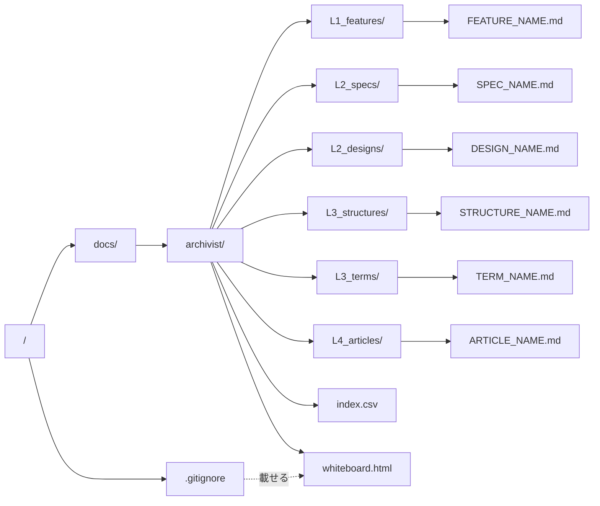
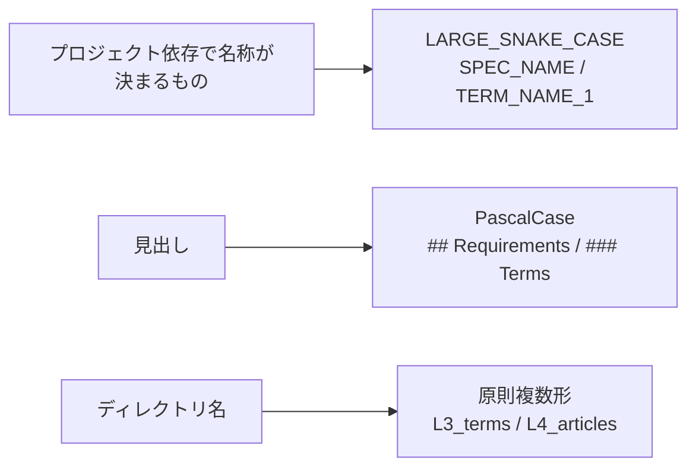

# directory-layout — 文書の配置と命名

## Diagrams

### D1 配置

6つのディレクトリが各ノードに1対1で対応する。ファイル名は中身が決める名前だけで、
状態を表す接頭辞を持たない。

`index.csv` は6つのディレクトリと並んで `docs/archivist/` の直下に置くが、ノードでは
ない。層に属さない生成物になる。

`whiteboard.html` も同じ場所に置く生成物で、ノードではない。対象プロジェクトの
`.gitignore` に載り、git では追わない。

### D2 命名

名前の記法を三つに分ける。プロジェクトごとに中身が変わるものは LARGE_SNAKE_CASE、
見出しは PascalCase、ディレクトリ名は原則複数形とする。どの記法に当たるかは、
その名前が文書のどこに置かれるかで決まるので、迷う場面は生じない。

## Articles
- [印を置かず、実現先の実在は判定で読む](../L4_articles/no-mark-on-documents.md)
- [生成される索引は層に属さない](../L4_articles/index-outside-layers.md)
- [条項が増減させる一覧は structure に置く](../L4_articles/enumeration-as-mapping.md)
- [L4 の文書は条項と呼び、中身を制限しない](../L4_articles/l4-documents-are-articles.md)
- [ホワイトボードは git で追わない](../L4_articles/whiteboard-not-tracked.md)

## References

### Structures

- [document-layers](document-layers.md)

### Terms

- [layer](../L3_terms/layer.md)
- [index](../L3_terms/index.md)
- [whiteboard](../L3_terms/whiteboard.md)
