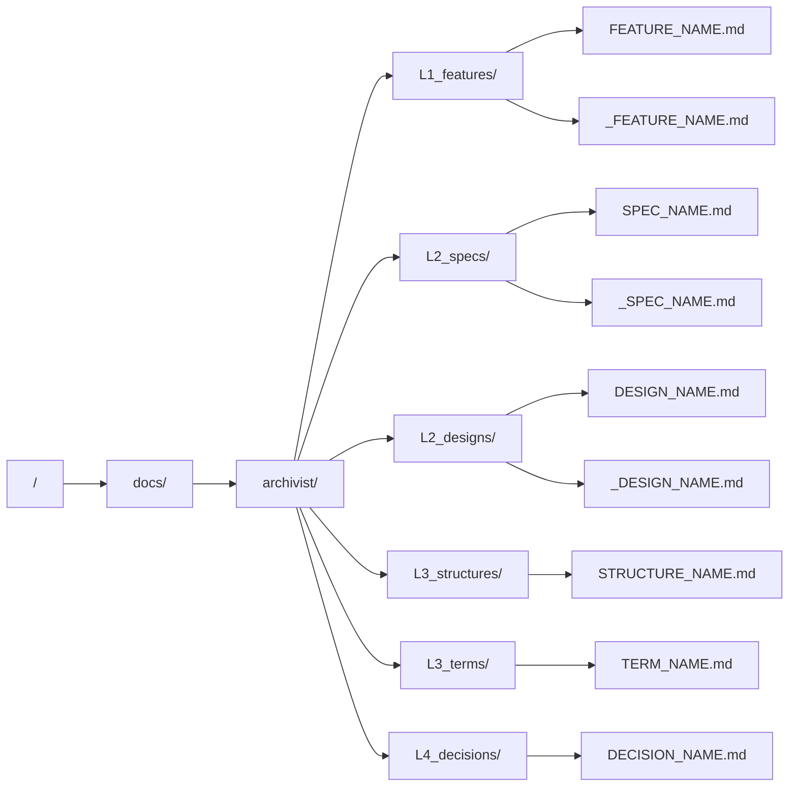
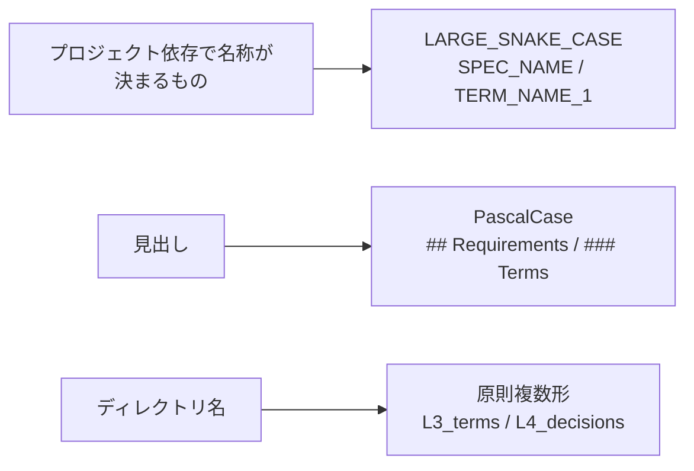

# directory-layout — 文書の配置と命名

## Diagrams

### D1 配置

6つのディレクトリが各ノードに1対1で対応する。印が付くのは実現先を持つ三層だけで、
`L3_structures` `L3_terms` `L4_decisions` には枝が無い。

### D2 命名

名前の記法を三つに分ける。プロジェクトごとに中身が変わるものは LARGE_SNAKE_CASE、
見出しは PascalCase、ディレクトリ名は原則複数形とする。どの記法に当たるかは、
その名前が文書のどこに置かれるかで決まるので、迷う場面は生じない。

## Decisions
- [印が付くのは実現先を持つ層だけ](../L4_decisions/mark-only-where-realized.md)
- [決断が増減させる一覧は structure に置く](../L4_decisions/enumeration-as-mapping.md)

## References

### Structures

- [document-layers](document-layers.md)

### Terms

- [layer](../L3_terms/layer.md)
- [mark](../L3_terms/mark.md)
