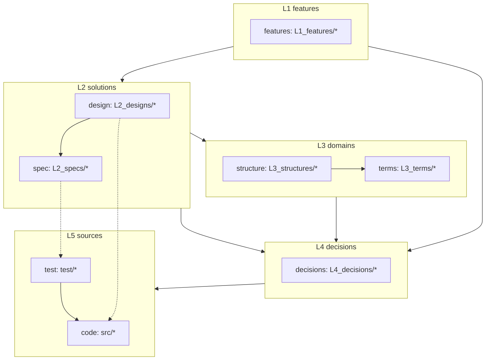
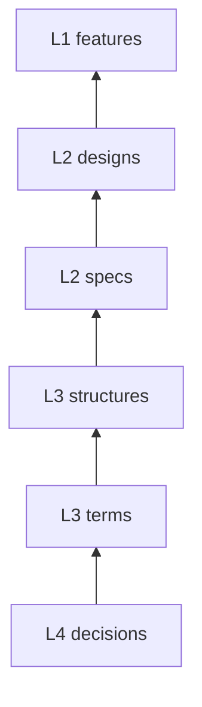
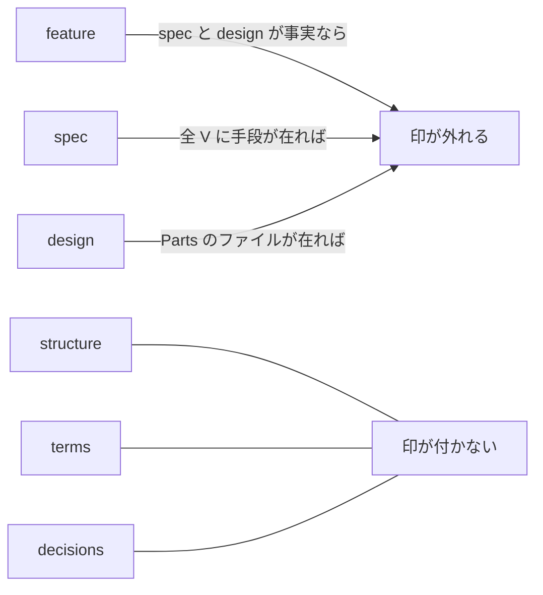

# document-layers — 文書の層と参照の向き

## Diagrams

### D1 層のグラフ

実線は参照の方向で、上の層から直下の層へ引く。破線は実装の対応を示し、
参照の順序には数えない。decisions だけは例外で、どの層からも直接指せる。

破線が spec から test へ、design から code へ分かれているのは、test が spec だけを
読んで書けるためにある。design から test への線は引かない。

### D2 還元の向き

参照は上から下へ張るが、書き起こしは下から上へ進む。この向きが
archivist の起動順そのものになる。

### D3 印が付く層

実現先を持つ三層にだけ印が付く。structure と terms は決断の像であり、
実装の有無で状態が変わらない。

## Decisions
- [印が付くのは実現先を持つ層だけ](../L4_decisions/mark-only-where-realized.md)
- [テストコードは spec だけを読んで書ける](../L4_decisions/test-from-spec-alone.md)
- [層は飛ばさない。decisions だけが例外](../L4_decisions/no-layer-skip.md)
- [時間的な要素を文書に持たせない](../L4_decisions/no-time-factor.md)

## References

### Terms

- [layer](../L3_terms/layer.md)
- [reference](../L3_terms/reference.md)
- [reduction](../L3_terms/reduction.md)
- [test](../L3_terms/test.md)
- [mark](../L3_terms/mark.md)
