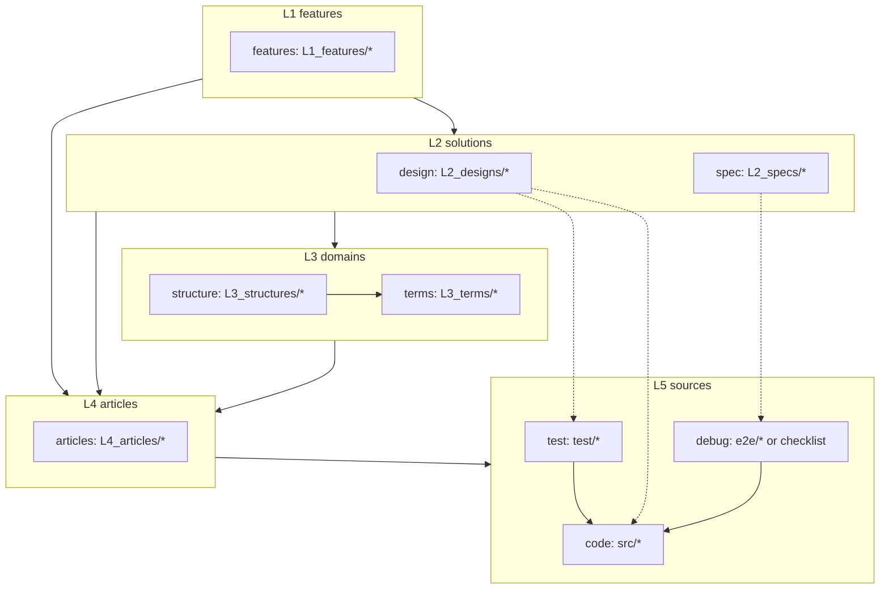
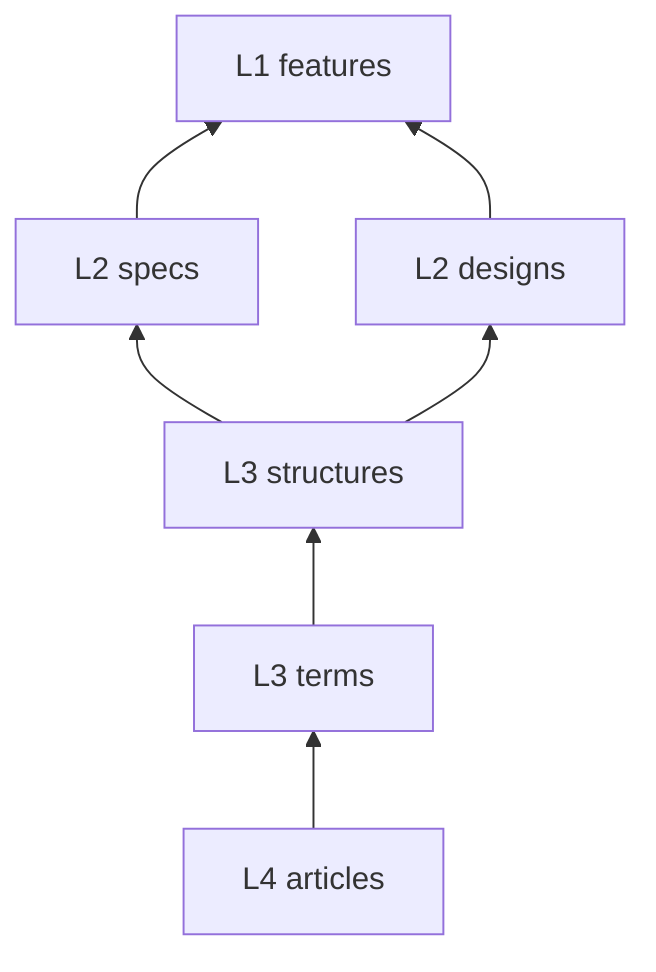

# document-layers — 文書の層と参照の向き

## Diagrams

### D1 層のグラフ

実線は参照の方向で、上の層から直下の層へ引く。破線は実装の対応を示し、
参照の順序には数えない。articles だけは例外で、どの層からも直接指せる。

L2 の二つに線は無い。spec と design は対等な並列で、どちらの向きにも引かない。
両者が矛盾していないことは feature の Coverage 表が担保する。

破線が spec から debug へ、design から test へ分かれているのは、二つの検証が
別のものを判定するためにある。debug は成果物を動かして約束を判定し、test は
材料をパーツ単位で判定する。spec から test へも、design から debug へも線は引かない。

### D2 還元の向き

参照は上から下へ張るが、書き起こしは下から上へ進む。この向きが
archivist の起動順そのものになる。

L2 で経路が二叉に割れる。specs と designs は互いを待たないので、順不同に書ける。
合流するのは features ただ一つで、そこで初めて両方が揃っている必要が出る。

## Articles
- [印を置かず、実現先の実在は判定で読む](../L4_articles/no-mark-on-documents.md)
- [debug は spec だけを読んで書ける](../L4_articles/debug-from-spec-alone.md)
- [test は design を読んで書く](../L4_articles/test-from-design.md)
- [spec と design は互いを引かない](../L4_articles/spec-design-independent.md)
- [spec と design の整合を担保するのは feature だけ](../L4_articles/feature-joins-spec-and-design.md)
- [層は飛ばさない。articles だけが例外](../L4_articles/no-layer-skip.md)
- [時間的な要素を文書に持たせない](../L4_articles/no-time-factor.md)

## References

### Terms

- [layer](../L3_terms/layer.md)
- [reference](../L3_terms/reference.md)
- [reduction](../L3_terms/reduction.md)
- [test](../L3_terms/test.md)
- [debug](../L3_terms/debug.md)
