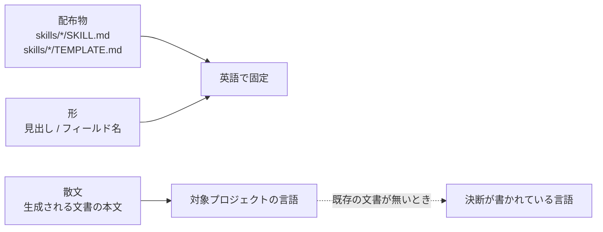

# language-split — 言語の分かれ方

## Diagrams

### D1 三つの言語域

配布物は誰の手にも渡るので英語で固定する。形は機械が読む位置なので言語を持たない。
散文だけが対象プロジェクトに従う。

既存の文書が無いプロジェクトでは、決断が書かれている言語に合わせる。決断は文書の
起点であり、そこに書き手の言語が既に現れている。

## Articles
- [配布物は英語で書く](../L4_articles/distributed-content-in-english.md)
- [生成する文書の言語は対象プロジェクトに合わせる](../L4_articles/output-language-follows-project.md)

## References

### Terms

- [form](../L3_terms/form.md)
- [decision](../L3_terms/decision.md)
