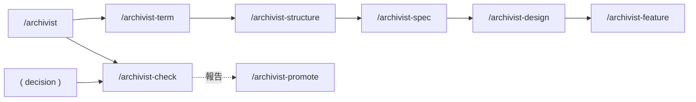
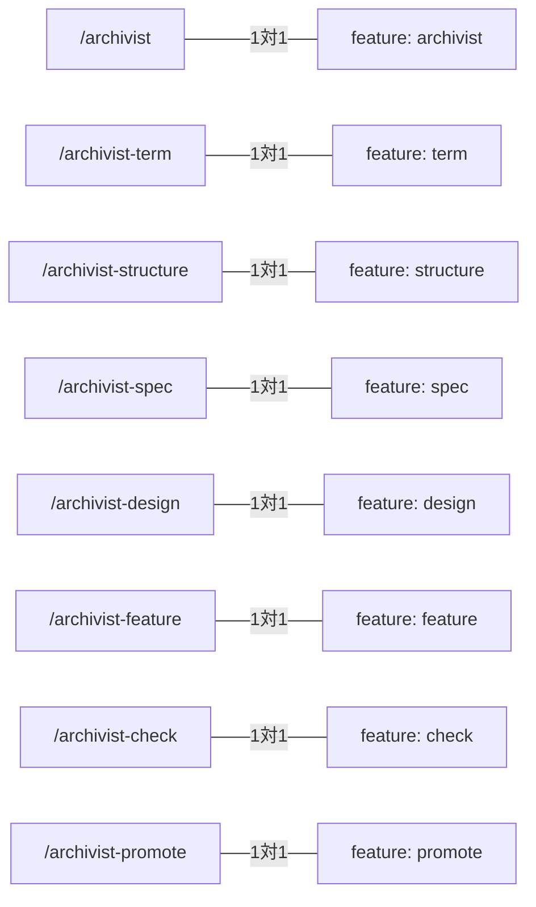

# skill-composition — スキルの構成

## Diagrams

### D1 スキルの構成と起動順

archivist がオーケストレーターとして伝播を司る。起動順は還元の向きに従う。
check も decisions を受け取るが、書かずに読むだけで判定を返す。
promote は check の報告を受け、`_` の除去と流入リンクの書き換えを行う。
decision は すでに存在するものとし、このskillでは作成しない。

### D2 コマンドと feature の対応

起動できるコマンド1本が feature 1枚に対応する。片方だけが増えた状態は、
名指しできるのに約束が無いか、約束だけあって起動できないかのいずれかを意味する。

## Decisions
- [決断が増減させる一覧は structure に置く](../L4_decisions/enumeration-as-mapping.md)
- [コマンド1本を feature 1枚とする](../L4_decisions/command-is-feature.md)
- [`_` を外す作業は check から分ける](../L4_decisions/promote-separate-from-check.md)
- [スキルは文書の要素ごとに割る](../L4_decisions/skill-per-element.md)
- [還元はするが、決断はしない](../L4_decisions/reduction-not-decision.md)

## References

### Terms

- [reduction](../L3_terms/reduction.md)
- [feature](../L3_terms/feature.md)
- [decision](../L3_terms/decision.md)
