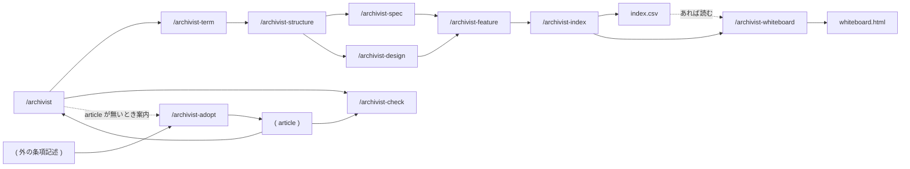
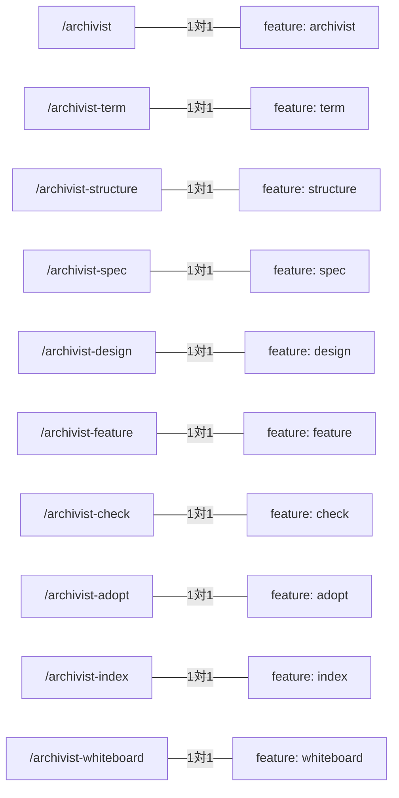

# skill-composition — スキルの構成

## Diagrams

### D1 スキルの構成と起動順

archivist がオーケストレーターとして伝播を司る。起動順は還元の向きに従う。
spec と design は structure の後で二叉に割れ、互いを待たない。合流するのは
feature ただ一つで、そこで両者が対応表として突き合わされる。
check も articles を受け取るが、書かずに読むだけで判定を返す。
article は すでに存在するものとし、このskillでは作成しない。
index は archivist が最後に呼び、書き上がった文書群を読んで索引を組み直す。層に属さない
ことと、起動順の外にあることは別になる。索引は生成物で、他のスキルはその存在を
前提にしない。
whiteboard は index の直後、起動順の最終段で1回呼ばれる。索引が先に組み直されて
いるので、盤面は古い索引を読まない。
adopt は Order の外に立ち、archivist が回り始める前に article を用意する。
archivist は article が一枚も無いときだけ adopt を案内し、呼びはしない。

### D2 コマンドと feature の対応

起動できるコマンド1本が feature 1枚に対応する。片方だけが増えた状態は、
名指しできるのに約束が無いか、約束だけあって起動できないかのいずれかを意味する。

## Articles
- [条項が増減させる一覧は structure に置く](../L4_articles/enumeration-as-mapping.md)
- [コマンド1本を feature 1枚とする](../L4_articles/command-is-feature.md)
- [印を置かず、実現先の実在は判定で読む](../L4_articles/no-mark-on-documents.md)
- [スキルは文書の要素ごとに割る](../L4_articles/skill-per-element.md)
- [還元はするが、条項は立てない](../L4_articles/reduction-not-article.md)
- [条項の取り込みは archivist の外に置く](../L4_articles/adoption-outside-archivist.md)
- [生成される索引は層に属さない](../L4_articles/index-outside-layers.md)
- [ホワイトボードは還元の最後に、索引の後で組み直す](../L4_articles/whiteboard-follows-index.md)

## References

### Terms

- [reduction](../L3_terms/reduction.md)
- [feature](../L3_terms/feature.md)
- [article](../L3_terms/article.md)
- [adoption](../L3_terms/adoption.md)
- [index](../L3_terms/index.md)
- [whiteboard](../L3_terms/whiteboard.md)
