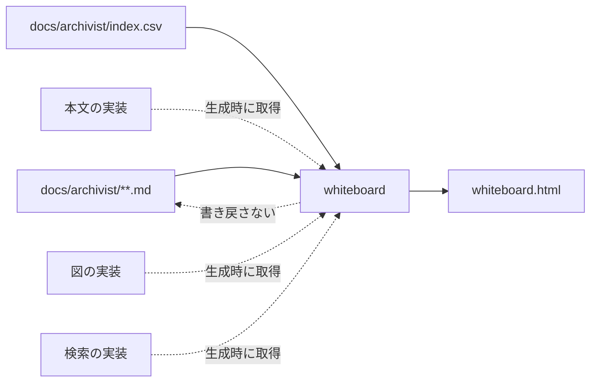
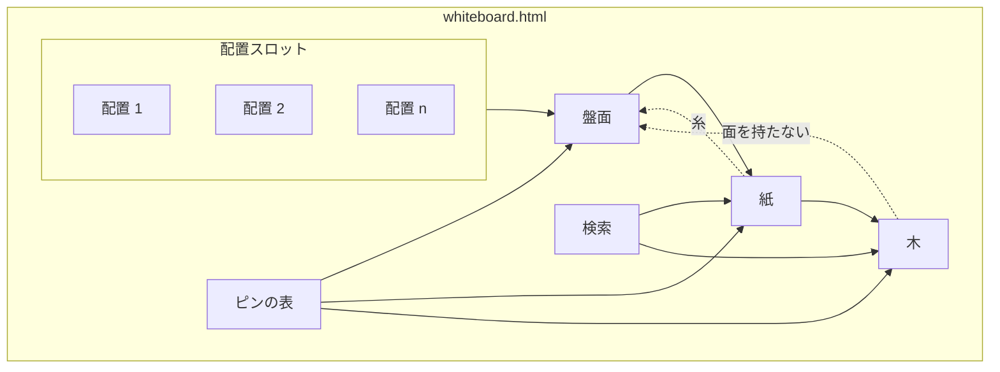
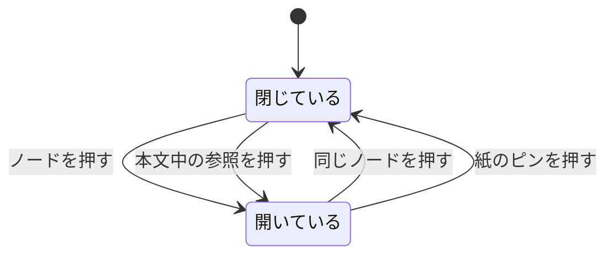
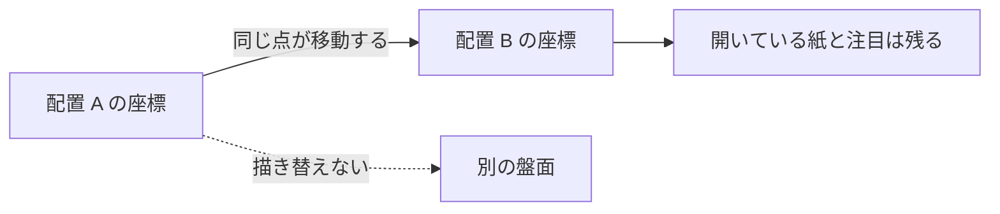
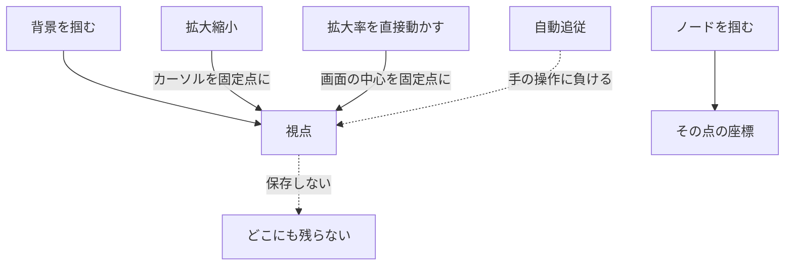
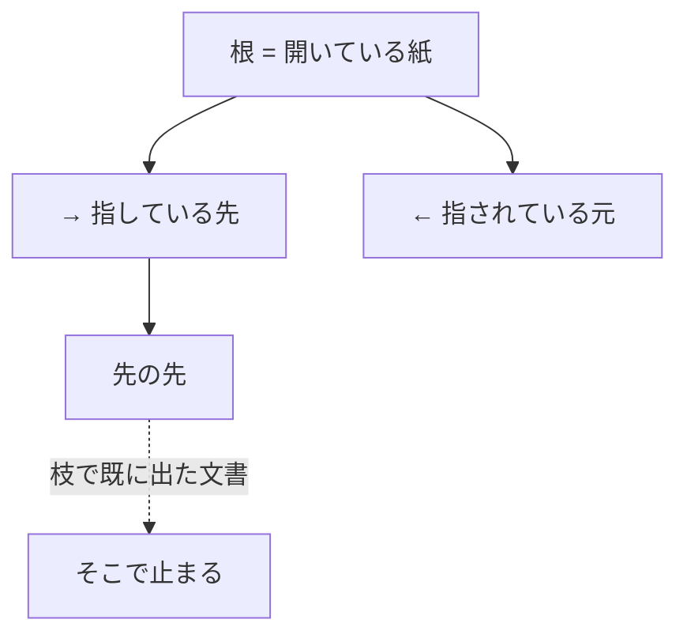

# whiteboard — ホワイトボードの構成

## Diagrams

### D1 生成の流れ

入力は `docs/archivist/` の文書と索引だけで、出力は HTML 1枚になる。外から取り込む
実装は本文・図・検索の3つで、いずれも生成の時点で取得して出力へ埋め込む。閲覧時に
取りに行かないので、出力は単体で開ける。取得できなかったものは、その働きを持たない
まま出る。代わりの実装は持たない。
生成は文書へ何も書き戻さない。向きは常に文書から出力への一方向になる。

### D2 盤面の要素

盤面は配置スロットから座標を、ピンの表から色と形を受け取る。配置は複数あり、
どれも同じ盤面に差し込める。ピンの表は1つで、盤面と紙の両方がそこから引く。
紙は盤面の上に開き、開いた元のノードへ糸で繋がる。盤面の外へは出ない。木は開いている
紙から根を受け取り、ピンの表から色と形を受け取る。木は盤面の上に重なるが面を持たない。
検索は語から文書へ辿り着く入口で、そこから開いたものは紙になり、木の根になる。

### D3 紙の開閉

紙は開くと閉じるの2状態しか持たない。開く操作は2つ、閉じる操作は2つになる。
閉じる操作を元のノードと紙自身の両方に持たせるのは、盤面の外へ出さない以上、
紙が盤面のどこにあっても手が届く必要があるため。
複数の紙が同時に開いている状態を許す。この図は紙1枚の状態を示す。

### D4 配置の切り替え

切り替えは点の移動として起きる。盤面を描き替えないので、どの点がどこへ行ったかが
そのまま情報になる。保たれるのは点の同一性と、開いている紙、注目しているノードで、
移動の速さや軌跡は条件に入らない。移動の途中でも盤面は触れる。

### D5 視点の操作

視点を変える操作は2系統に分かれる。掴む操作は、背景なら視点が、ノードならその点の
座標が動く。拡大縮小はカーソルの下を固定点にし、拡大率を直接動かす手段だけは
指す対象を持たないので中心を固定点にする。自動追従を持つ場合、手が触れた時点で外れる。

### D6 木の形

木の根は開いている紙で決まり、ポインタでは変わらない。枝は指している先と指されて
いる元の2方向に出る。先の先へ辿れるが、同じ文書が枝の中で再び現れた時点でその枝は
止まる。参照は循環しうるもので、木は循環を表現できない。

## Articles
- [ホワイトボードは文書から生成され、文書を書き換えない](../L4_articles/whiteboard-generates-from-documents.md)
- [盤面の配置に正解を1つ置かない](../L4_articles/whiteboard-layout-has-no-single-answer.md)
- [ピンは一つの表から引く](../L4_articles/whiteboard-pins-come-from-one-table.md)
- [できあいの実装は生成時に取り込む](../L4_articles/whiteboard-outside-implementations.md)
- [文書は盤面の上で開く](../L4_articles/whiteboard-documents-open-on-the-board.md)
- [盤面は掴んで動かす](../L4_articles/whiteboard-the-board-is-dragged.md)
- [ズームはカーソルを固定点にする](../L4_articles/whiteboard-zoom-anchors-at-the-cursor.md)
- [配置の切り替えは点の移動で行う](../L4_articles/whiteboard-layout-change-is-a-move.md)
- [盤面は画面より広く開く](../L4_articles/whiteboard-opens-wider-than-the-screen.md)
- [開いている文書の周りは木として出す](../L4_articles/whiteboard-open-document-shows-its-tree.md)
- [検索は本文まで届く](../L4_articles/whiteboard-search-reaches-the-body.md)

## References

### Structures

- [directory-layout](../L3_structures/directory-layout.md)

### Terms

- [whiteboard](../L3_terms/whiteboard.md)
- [layout](../L3_terms/layout.md)
- [pin](../L3_terms/pin.md)
- [paper](../L3_terms/paper.md)
- [view](../L3_terms/view.md)
- [tree](../L3_terms/tree.md)
- [search](../L3_terms/search.md)
